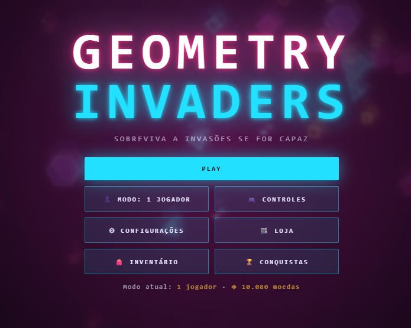
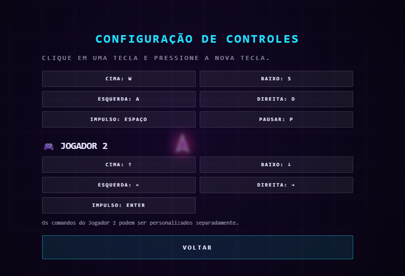
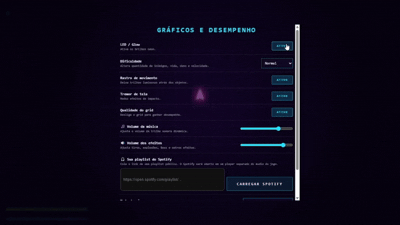

# Geometry-Invades

***Nome:*** Samuel G.S.Rosa
***Turma:*** 2º Ano TEC — Desenvolvimento de Sistemas  
***Instituição:*** SENAI  
***Ano:*** 2026

## Descrição 

O meu projeto e parecido com o jogo asteroids de fliperama com diversos itens, inimigos e modos para desafiar o jogador com o objetivo de destruir os inimigos ate o máximo que você consegue sobreviver, o Geometry Invades e um jogo desenvolvido com a ajuda dos meus professores Wallison Rocha e Erika Sardinha, que desenvolveu o jogo e passou para minha sala desenvolver melhorias para o jogo em HTML, CSS e Js.

## Objetivo do Projeto

O objetivo foi analisar o código-fonte de um jogo existente, compreender seu funcionamento e realizar modificações utilizando conceitos de desenvolvimento de sistemas.
Após as alterações, o projeto foi publicado no GitHub e disponibilizado por meio do GitHub Pages.

## Tecnologias

- HTML5
- CSS3
- JavaScript
- Canvas API
- Web Audio API
- GitHub
- GitHub Pages

## Instalação e USo

Para começar a jogar, basta apenas fazer o download do arquivo principal do game disponibilizado neste repositório, abrir usando um navegador web e dar o play ou joga pelo link do jogo que redirecionara para o jogo direta para a web.

### Como jogar

#### Computador

quando Abrir o arquivo, o jogo vai te direcionar para o menu.

antes de começar uma partida você pode ver é mudar algumas coisas, como os controle e a configuração, como as texturas o modo de dificuldade e etc.

O jogo também tem um modo multiplayer para que possa tentar chegar mais longe e divertir com seu amigo para ver que tem mais habilidades.

.gif)

### Celular

O jogo também possui suporte a toque na tela para movimentação.

## Modificações realizadas

caso você vai nas configurações vai perceber que tem um lugar para colocar um link, aquele lugar e um espaço para você poder conectar sua playlist do spotify para que toque com sua musicas enquanto joga, também tem a parte de inventario, loja e conquistas, comprando alguma personalização você pode equipar indo no inventario, as conquistas té dará moedas para comprar personalização, também sendo capaz de conseguir jogando uma partida.
